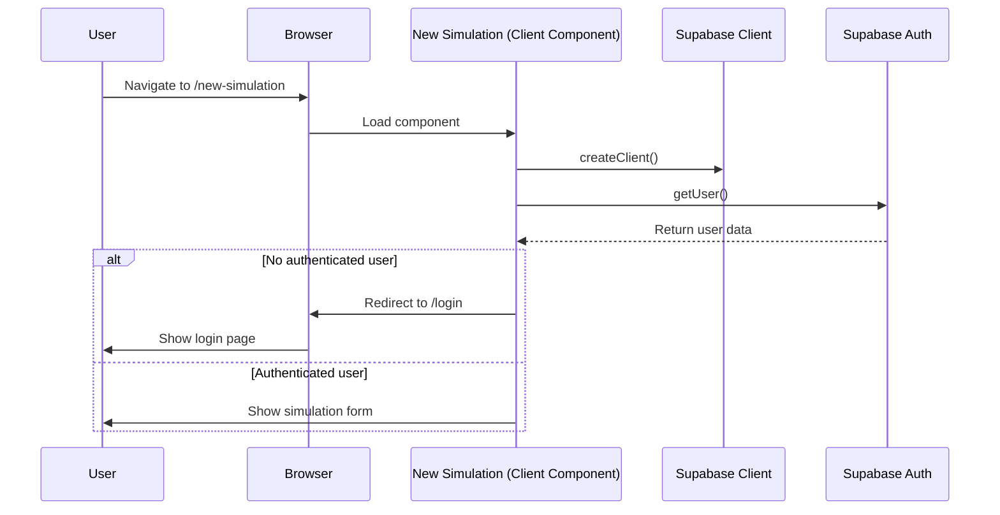
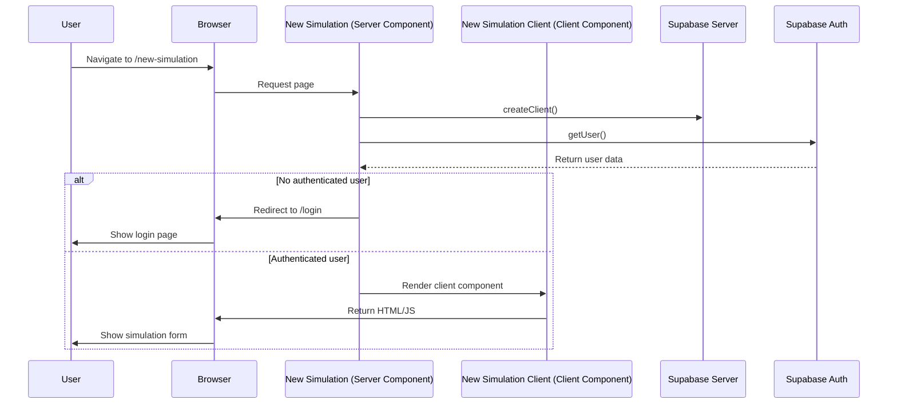
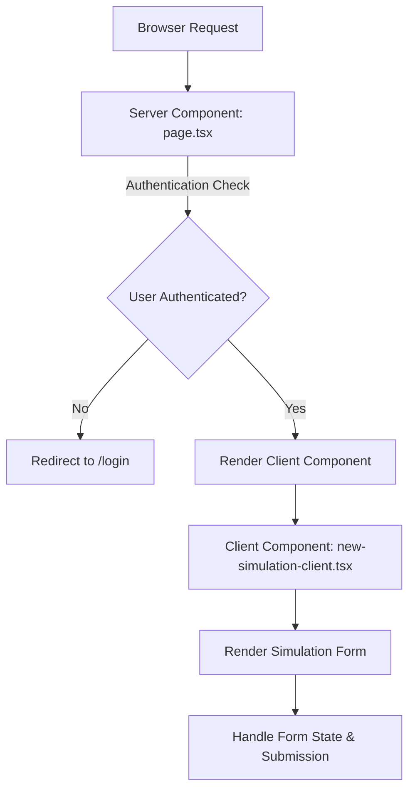

# Authentication Flow Diagram

## Current Authentication Flow (Client-Side)



## New Authentication Flow (Server-Side)



## Component Structure



## File Structure

```
src/app/new-simulation/
├── page.tsx                  # Server component that checks auth
└── new-simulation-client.tsx # Client component with form logic
```

## Authentication Check Comparison

### Before (Client-Side)

```tsx
// In page.tsx (client component)
useEffect(() => {
  const checkAuth = async () => {
    const supabase = createClient(); // Client-side Supabase
    const { data, error } = await supabase.auth.getUser();

    if (error || !data?.user) {
      router.push("/login");
    }
  };

  checkAuth();
}, [router]);
```

### After (Server-Side)

```tsx
// In page.tsx (server component)
const supabase = await createClient(); // Server-side Supabase
const { data, error } = await supabase.auth.getUser();

if (error || !data?.user) {
  redirect("/login");
}

return <NewSimulationClient />;
```
